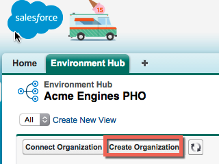
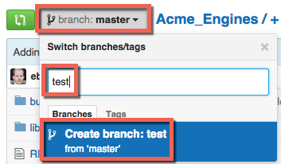
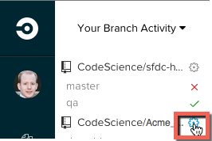

# Quick Start
Get started with continuous integration on the Salesforce.com platform

### Adding a remote (as "circle") the repo from we want to pull from 
```$ git remote add circle https://github.com/CodeScience/circle-start.git```

### Fetch the circle branches
```$ git fetch circle```

#### pull from the deply branch of the circle remote
```$ git pull circle deploy```
or
```$ git pull circle deploy-with-CumulusCI```

# Full Circle CI/Salesforce Setup
## Overview

This document shows how to setup a PDO Salesforce project to use a “simple DevOps” process with “Partner Hub Organization”(PHO)/EnvironmentHub, GitHub and CircleCI. This document will detail the following high level steps:

1. Determine your environment/branch strategy, specifically the number of Development and Test environments and the promotion path of the environments.
2. Create the development, test and packaging orgs via your project’s PHO. Please note that your PHO and Packaging Org should be two different orgs!
3. Create your project in GitHub
4. Clone the [“circle-start”](https://github.com/CodeScience/circle-start) repo into your GitHub project’s MASTER branch
5. Create the build properties for each environment
6. Create the branches in your GitHub project
7. Setup CircleCI

## Pre-Reqs
This document assumes the following:

* Your project has its own PHO/Environment Hub
* You have access to the CodeScience GitHub Account
* You have some basic understanding of branching/environment strategy
* You are working on a PDO project that will have its own PHO/Environment Hub and NOT an SI/Commercial project that is limited to a static number of Sandboxes.
* You have about an hour available to do this.


This document will use the “Lattice Engines” project as an example, but each project is different encompassing many variables. The following variables could be different for your project

*  The number of developers on your project will directly impact the number of branches and Partner Developer Edition (PDE) orgs needed.
* The number of QA/Test environments. This document assumes 1 environment.
* This document assumes that there is a 1:1 relationship between a branch and a Salesforce org. DO NOT build multiple branches into a single org or build the same branch into multiple orgs.
* This document also assumes that you’re starting a brand new project that has no existing code.

## Environment/Branch Strategy

For this document, we will assume our project has 3 developers, John Smith, John Doe and Bob Barker. For purposes of this document, we’ll assume that “Bob Barker” is also a PO/PM who will be performing some configuration of objects, fields, layouts, rules, etc but not necessarily writing any code. Because there are 3 people authoring new code & configuration, we’ll need 3 PDE orgs and 3 branches in GitHub:

* dev.jsmith
* dev.jdoe
* dev.bbarker

Additionally, let’s assume we want a single test environment where all changes will be merged together and surfaced to the client for testing before we build a package. This will result in 1 PDE org and 1 branch in GitHub:
test

Lastly, let’s assume we want a single packaging org where all configuration and code will be packaged and uploaded. This will result in another PDE and 1 “MASTER” branch in GitHub.

Given these assumptions, we can draw a pretty picture that graphically represents this:


## Create Orgs
Now that we know what we want our CI setup to look like, we need to create all these orgs. From within your project’s PHO, follow these steps:

1. Click “Create Organization”


2. Select “Development” for purpose
3. Next specify the following:
  * Organization Name: Use the name of the proposed branch. For example “dev.jsmith”
  * My Domain: Use the name of the project + proposed branch. For example, “lattice-dev-jsmith”
  * First Name: Use the developer’s first name. For example, “John”.
  * Last Name: Use the developer’s last name. For example, “Smith”.
  * Username: Use the developer’s email address, but appended with the my domain. For example: “jsmith+lattice-dev-jsmith@codescience.com”
  * Agree to the legal agreement and click “create”
4. After the org has been created, login to the org, establish a password and generate the security token. Write these down, you’ll need them later!!
  * Alternatively, have the individual developers log in and establish these for you, but they’ll need to share the info.
5. Repeat steps 1 - 4 for each org/branch that needs to be created. For our example, that’s:
  * dev-jdoe
  * dev-bbarker
  * test
  * pkg
  
## Create Project in GitHub

Now it’s time to create our project in GitHub.

1. Login to GitHub.com
2. Navigate to https://github.com/CodeScience
3. Click “+New Repository”


4. Give the repo a name, for example “lattice”.
  * Be sure to leave the project as “private”. Our customers don’t pay us to give their intellectual property to the world for free.
  * Be sure to select “Initialize this repository with a README”
  
## Clone circle-start Into The Project

Now we need to add all the files and configurations necessary to make CircleCI work. We do this by cloning everything in the circle-start repo into the repo.

1. First we need to create a local copy of our project’s repo. On your computer, open a command line and navigate to a project home folder of some kind. `cd ~/Documents/MavensMate/`
2. Clone the repo
  `git clone https://github.com/CodeScience/lattice.git`
  Replace “lattice” with the name of your project’s repo.
3. Change into the project folder
  `cd lattice`
4. Add the circle-start repo
  `git remote add circle https://github.com/CodeScience/circle-start.git`
5. Fetch the contents of the circle-start repo
  `git fetch circle`
6. Merge the contents of the circle-start “deploy-with-CumulusCI” branch into your project
  `git pull circle deploy-with-CumulusCI`
7. Don’t close the command line, you’ll need it for the next section

## Build Properties
Getting closer… Now we need to tell CircleCI how to login to each PDE.

1. On the command line, change into the “build” folder
`cd build`
2. Copy the build.master.properties file for the dev.jsmith org/branch as follows:
`cp build.master.properties build.dev.jsmith.properties`
3. Now, using your favorite text editor, edit the contents of this newly copied file. We need to modify the “sf.username” and “sf.password” properties to point to environment variables that are named after our dev branch/org. Additionally, we need to give our project a package name. Make sure the “sf.package.name” property has the same value for all build.*.properties files: For example:


4. Save the changes
5. Repeat steps 1 - 3 for each branch/org, EXCEPT test and Pkg (they already exist as build.test.properties and build.master.properties):

  * dev.jdoe
  * dev.bbarker
  
6. When complete with the build properties files, we now need to commit all of our changes to GitHub:
  * `cd ../`
  * `git add *`
  * `git commit -m "Adding CircleCI Files"`
  * `git push`
7. Validate that your repo in GitHub looks something like:
 


## Create Branches

So… close… Now we need to create our branches in GitHub. Fortunately, the “MASTER” branch (the branch that represents our Packaging environment) already exists. It will serve as the foundation for all the other branches.

1. Within your repo at GitHub.com
Click the “branch: Master” dropdown button, type “test” in the “Find or create a branch…” field, then click 
2. “Create Branch: test from ‘master’”



3. Congratulations! You just created the test branch.
4. Now, click the “branch: test” dropdown button, type “dev.jsmith” in the “Find or create a branch…” field, then click “Create branch: dev.jsmith from ‘test’”


5. Repeat step #4 above for all the other dev branches:
  * dev.jdoe
  * dev.bbarker

## Setup CircleCI

Ok, this is the last section… We’ve setup all the foundational pieces and are ready to configure CircleCI to perform builds.

1. Go to CircleCI.com and click “log in”. It will redirect you to github, which may ask you to sign in with your github credentials, after which you’ll be redirected back to CircleCI.com.
2. Your homepage will look something like this:

It’s empty because we haven’t started following any projects yet.

3. Click the “+” button on the left hand nav bar
4. Now click “CodeScience” under the “1) Your accounts” section
5. Now filter the repos for your projects repo and click “Build Project”:


6. Now, let’s setup the environment variables. In the “Your Branch Activity” pane, hover over your project and click the gear icon:


7. Hopefully you wrote down the usernames and passwords+security tokens for all orgs that you setup in the “Create Orgs” step. Now, navigate to “Environment Variables”:
  * Enter “MASTER_USERNAME” for the “Name” field.
  * Enter the username of your user in the packaging org for the “Value” field.
  * Click “Save variables”
  * Enter “MASTER_PASSWD” for the “Name” field.
  * Enter the password+security token for the “Value” field.
  * Click “Save variables”
8. Repeat step 7 for all other PDE orgs using the respective environment variables that were defined in the build.[branch].properties files and that org’s username password:
  * test
    * TEST_USERNAME
    * TEST_PASSWD 
  * dev.jsmith
    * DEV_JSMITH_USERNAME
    * DEV_JSMITH_PASSWD
  * dev.jdoe
    * DEV_JDOE_USERNAME
    * DEV_JDOE_PASSWD
  * dev.bbarker
    * DEV_BBARKER_USERNAME
    * DEV_BBARKER_PASSWD

## Conclusion

Congratulations! The setup is complete. From here, your builds will automatically start whenever any changes are committed to the branches in GitHub. For more on that process, please see the Mac + Sublime + Mavens + Git Setup document.
